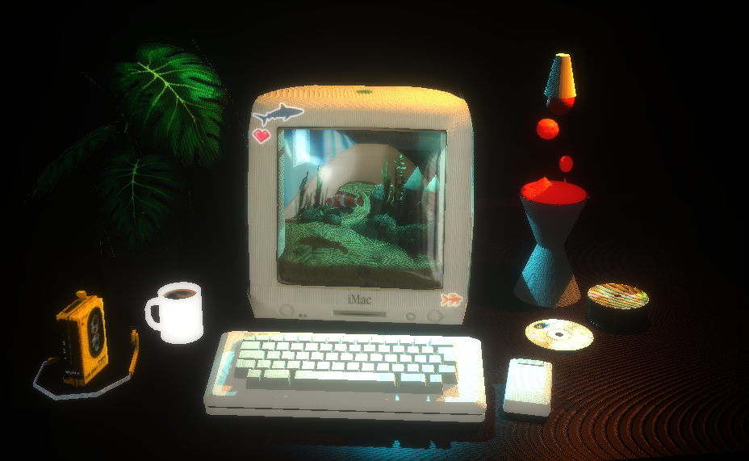

# iMac Aquarium
A small Computer Graphics project made in Three.js: an interactive iMac G3 acquarium, retrò looks and some good music to listen to. 

The preview is available at https://imac-aquarium.netlify.app !

## Local download and Usage
To run this locally (with webpack and Node.js), just download the repository and run 
`npx serve`